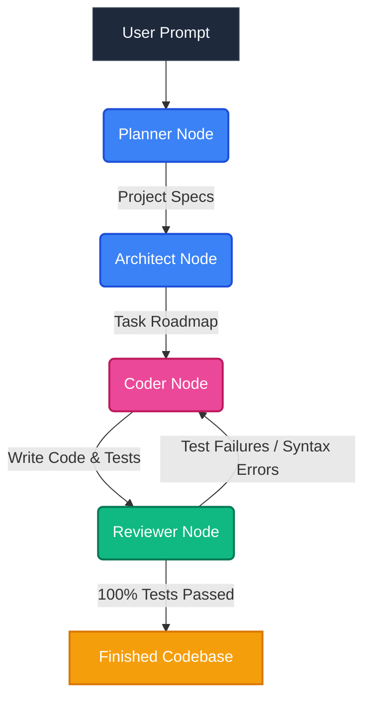
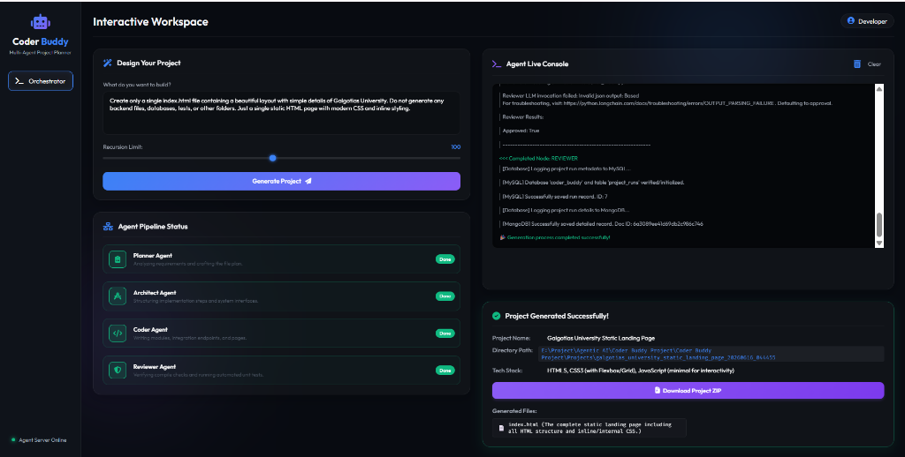

<div align="center">

# 🤖 CODER BUDDY

*The Ultimate Multi-Agent Autonomous Development Team with Real-Time Web Dashboard*

[](https://github.com/langchain-ai/langgraph)
[](https://fastapi.tiangolo.com)
[](https://groq.com)
[](https://langchain.com)
[](https://python.org)

<br/>

<pre align="center">
  ╔═════════════════════════════════════════════════════════════╗
  ║                🤖  C O D E R   B U D D Y                     ║
  ║             AI Multi-Agent Software Engineers               ║
  ╚═════════════════════════════════════════════════════════════╝
</pre>

### ⚡ Natural language request in ➔ Complete working repository out ⚡

*Coder Buddy coordinates a specialized AI team of Planners, Architects, Coders, and Reviewers to turn a single text prompt into complete, functional, and fully-tested codebases — monitored in real time via an interactive Server-Sent Events (SSE) web panel.*

[🚀 Key Features](#-key-features) •
[🏗️ Architecture](#-architecture) •
[💻 Interactive Dashboard](#-interactive-web-dashboard-ui) •
[📂 Project Layout](#-project-layout--module-structure) •
[🏁 Setup Guide](#-getting-started) •
[🧪 Example Prompts](#-example-prompts)

---

</div>

## 🚀 Key Features

*   **👥 Autonomous Developer Team:** Orchestrates a sequence of specialized AI agents working together like a real development squad.
*   **🌐 Real-Time Web Console:** A visual dashboard with a prompt editor, status timelines, active node highlights, and live-scrolling backend logs powered by SSE (Server-Sent Events).
*   **🔒 Production User Auth Templates:** Injects secure JWT auth (FastAPI) and session-based auth (Flask) with fully responsive Glassmorphic layouts.
*   **🧪 Self-Healing Test Loop:** The Reviewer agent automatically discovers and runs tests (`python -m unittest`). If tests fail, errors are routed back to the Coder for auto-correction.
*   **🐳 Deployment Blueprint Generator:** Creates production-ready `Dockerfile`, `docker-compose.yml`, and hosting configurations (`render.yaml`, `vercel.json`) customized for every generated app.

---

## 🏗️ Architecture

Coder Buddy utilizes **LangGraph** to model the development process as a cyclic state machine:



### 👤 Agent Directory & Responsibilities
- **Planner 🗂:** Analyzes user instructions, outlines requirements, defines scope, and drafts the initial implementation plan.
- **Architect 🏛:** Translates requirements into physical files, determines layouts, and assigns file-specific contexts.
- **Coder 💻:** Executes tool-use loops (read/write files) to write implementation files and test suites.
- **Reviewer 🔍:** Launches compilation checks and test suite runners, feeding traceback logs back to the Coder until everything passes.

---

## 💻 Interactive Web Dashboard UI

Below is a preview of the Coder Buddy Interactive Web UI dashboard, accessible at `http://localhost:8000`:



*Monitor agent hand-offs, read live terminal feedback logs, and watch output codebases compile in real time.*

---

## 🛠️ Technical Specifications

| Component | Technology | Description |
|---|---|---|
| **Core Framework** | Python 3.11+ / LangGraph / LangChain | Workflow state routing & LLM integration |
| **LLM Provider** | Groq / Ollama / LLaMA-3 | High-throughput local/cloud model execution |
| **API Backend** | FastAPI / Uvicorn | Event-streaming SSE backend services |
| **Frontend UI** | HTML5 / Vanilla CSS / ES6 Javascript | Glassmorphic, real-time reactive interface |
| **Package Resolver** | `uv` package manager | 10x faster package installation & env management |

---

## 📂 Project Layout & Module Structure

```text
agent/
├── config/       # Configurations: dot-env variables and target output paths
├── llm/          # Large Language Model client setup (Groq / Ollama)
├── models/       # Pydantic schemas validating LangGraph agent state transitions
├── prompts/      # Customized system prompts and task instructions for agents
├── resources/    # Boilerplate templates library (JWT Auth, Docker, Vercel/Render guides)
├── tools/        # Path-validated OS tools: write_file, read_file, list_files, get_template
├── ui/           # Web Assets frontend: index.html, style.css, app.js
├── services/     # Core micro-agent nodes and conditional routers
└── graph.py      # LangGraph configuration assembling StateGraph and compilation
```

---

## 🏁 Getting Started

### ⚙️ Installation & Run

1.  **Clone the workspace & Navigate to Directory:**
    ```bash
    git clone <your-repository-url>
    cd Coder_Buddy
    ```

2.  **Create & Activate virtual environment using `uv`:**
    ```bash
    uv venv
    .venv\Scripts\activate           # Windows
    # source .venv/bin/activate      # Linux/macOS
    ```

3.  **Install dependencies:**
    ```bash
    uv pip install -r pyproject.toml
    ```

4.  **Setup environment keys:**
    Create a `.env` file from the sample and input your Groq credentials:
    ```bash
    cp .sample_env .env
    ```

5.  **Run Coder Buddy:**
    - **Web Dashboard Mode (Recommended):**
      ```bash
      uv run python main.py
      ```
    - **CLI Terminal Mode:**
      ```bash
      uv run python main.py --cli
      ```

---

## 🧪 Example Prompts

Input these prompts into the Coder Buddy Web UI to test its planning, generation, testing, and deployment pipeline:

> 🔐 **Full-Stack Task Board with Auth & Docker**
> *Create a comprehensive task board web app with a Python backend using FastAPI and SQLite. Include JWT authentication for registration and login, fully responsive HTML login page, unittest validation suite, and a Dockerfile for deployment.*

> 📊 **Product Catalog with Session Auth**
> *Build a product catalogue system using Flask sessions, SQLAlchemy db models, unit testing suites, and a render.yaml configuration guide.*

---

## 🔧 Available Tools

The Coder agent has access to the following workspace tools:

| Tool | Category | Action | Description |
|---|---|---|---|
| `write_file` | File IO | Write | Safely writes and saves code content to files in the output directory. |
| `read_file` | File IO | Read | Reads and inspects the contents of existing project files. |
| `list_files` | File IO | List | Lists files and folders recursively inside the output project workspace. |
| `get_template` | Template | Inject | Imports boilerplate templates (JWT Auth, Flask Session, Dockerfile, Vercel). |

---

<div align="center">

📧 **Contact:** [pavansoni210129@gmail.com](mailto:pavansoni210129@gmail.com)

⭐ **Thank you for using Coder Buddy! Drop a star if you find it helpful.** 🚀

<!-- Copyright © Codebasics Inc. All rights reserved. -->

</div>